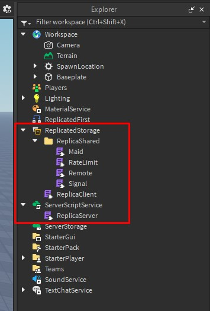

## Getting Replica

Replica is a collection of module scripts. Your goal is to make your project have these files in the correct containers:

### Option #1: Get Replica from the Roblox library

   - Get the library model [here](https://create.roblox.com/store/asset/84146677869807/Replica)
   - Move all modules to the correct containers to match the image above

### Option #2: Github

   - [Replica repository](https://github.com/MadStudioRoblox/Replica)